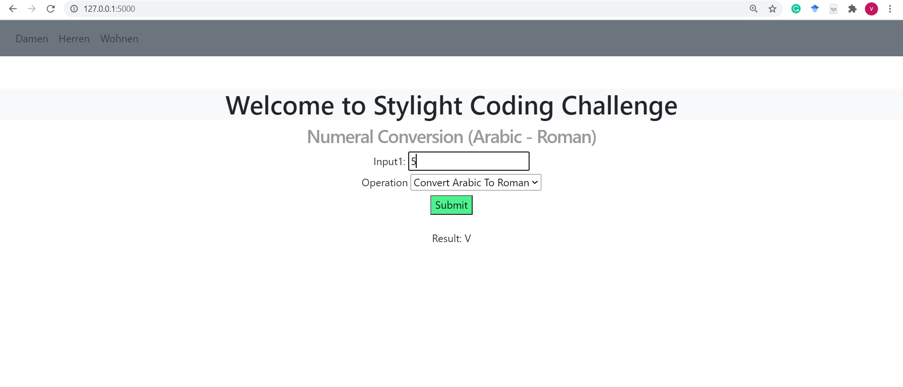

# Stylight Coding Challenge

To reproduce the repo, please follow the below steps:

Initially clone the repository and navigate to the project folder and run:
````
pip install -r requirements.txt
````

After successful installation of the libraries, run:

````
python main.py
````

The code was developed and tested using Python 3.7.6

Below is the sample of the home page outlook:
 